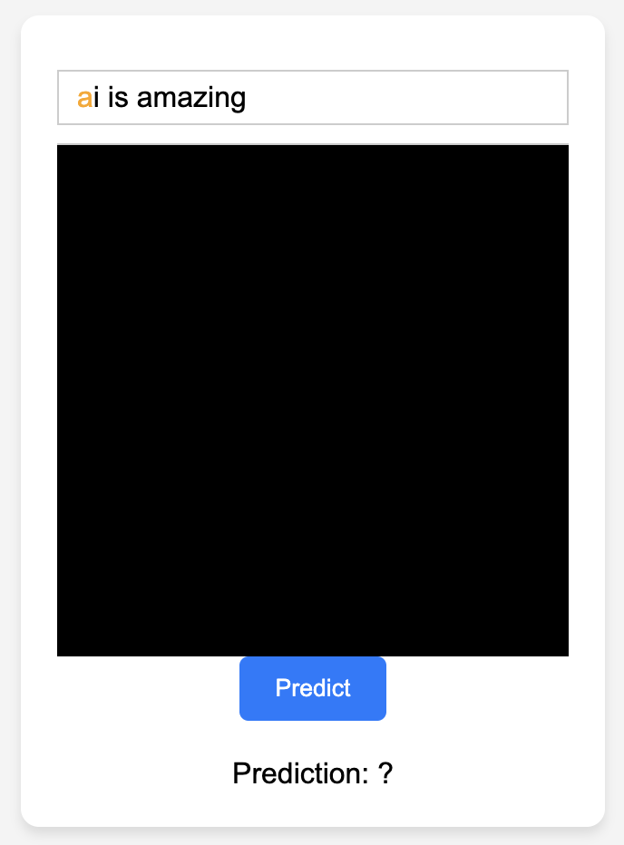

# Handwritten Letters Recognizer

A web-based application built to assist children in learning to write letters and digits. The application utilizes the power of ONNX.js to run a trained machine learning model directly in the browser to predict handwritten inputs.

| | |
|:--|:--|
| **A web-based application built to assist children in learning to write letters and digits.** The application utilizes the power of ONNX.js to run a trained machine learning model directly in the browser to predict handwritten inputs. |  |

## Features

- **Drawing Canvas**: A responsive canvas area where users can draw letters and digits.
- **Sentence Prompt**: Displays a randomly generated sentence. The app indicates the next letter or digit to draw with color cues:
  - **Orange**: Next letter or digit to be drawn.
  - **Green**: Correctly drawn letter or digit.
- **Mobile Support**: The app is optimized for both desktop and mobile devices.

## Use 

You need a browser that supports HTML5 (like Google Chrome, Mozilla Firefox).
You can directly try this app by clicking [here](https://hugodmn.github.io/keyboard_trackpad.github.io/).